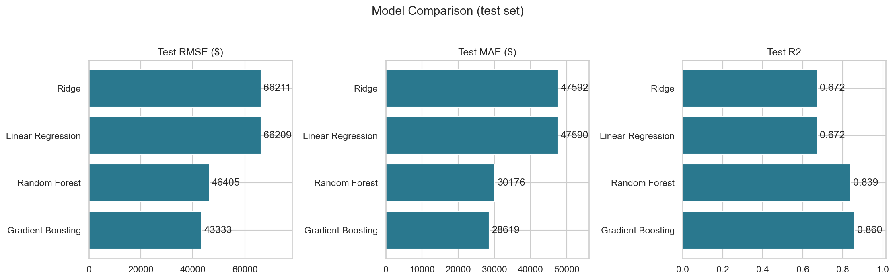
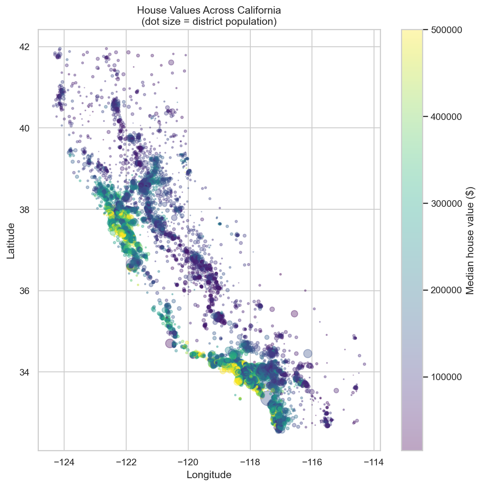
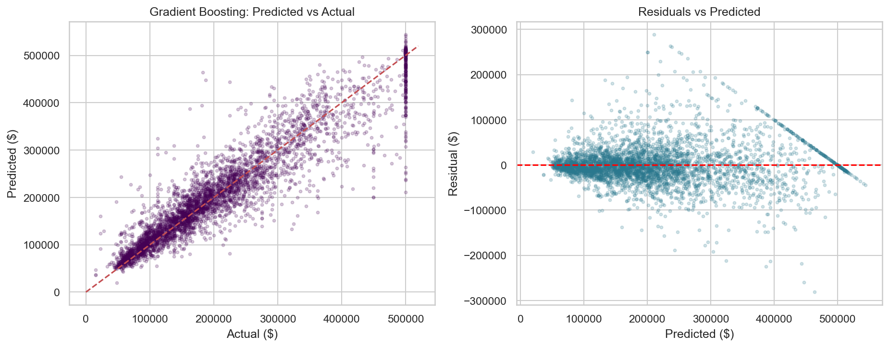

# 🏠 California Housing Price Predictor

An end-to-end machine learning project that predicts district-level median house
values in California — from raw data fetched via the Kaggle API, through EDA and
feature engineering, to a model comparison and an interactive Streamlit web app.

**Best model: Gradient Boosting — R² 0.86, average error ≈ $28,600.**




## 📊 The Data

[California Housing Prices](https://www.kaggle.com/datasets/camnugent/california-housing-prices)
(Kaggle) — 20,640 census districts from the 1990 California census. Each row is a
district: location, median income, housing stock counts, population, ocean
proximity, and the target `median_house_value` (capped at $500k).

The dataset is **not committed** to this repo — it's fetched automatically through
the Kaggle API on first run.

## 🔍 Key EDA Findings

| Finding | Consequence for modeling |
|---|---|
| Median income dominates (r ≈ 0.69) | Strong baseline even for linear models |
| Prices cluster around SF & LA, not along raw lat/lon | Tree models + distance features needed |
| `INLAND` districts dramatically cheaper | `ocean_proximity` one-hot encoded |
| Target capped at $500,001 (≈5% of rows) | Hard ceiling on accuracy for expensive areas |
| `total_bedrooms` missing in 207 rows | Median imputation (train-set median only) |



## 🛠️ Feature Engineering

- **Ratios** instead of raw counts: `rooms_per_household`, `bedrooms_per_room`,
  `population_per_household`
- **Distance to major metros** (LA, SF, San Diego, Sacramento) + distance to the
  nearest one — turns coordinates into economic meaning
- `log_population` to tame skew; one-hot `ocean_proximity` with fixed categories
- **80/20 split stratified on income quintiles**; imputation statistics learned
  on the training set only and persisted to `preprocessing.json` (no leakage,
  no training/serving mismatch)

## 🤖 Results

| Model | CV RMSE | Test RMSE | Test MAE | Test R² |
|---|---|---|---|---|
| Linear Regression | $66,810 | $66,209 | $47,590 | 0.672 |
| Ridge | $66,809 | $66,211 | $47,592 | 0.672 |
| Random Forest | $48,129 | $46,405 | $30,176 | 0.839 |
| **Gradient Boosting** ⭐ | **$45,119** | **$43,333** | **$28,619** | **0.860** |

Tree ensembles add ~19 points of R² over the linear baseline — that gap is the
non-linear signal (geographic clusters, income × location interactions). CV and
test scores agree within ~4% for every model: no overfitting.



## 🚀 Quick Start

```bash
git clone https://github.com/sabertooth-123/Housing_Price_simulator.git
cd Housing_Price_simulator
pip install -r requirements.txt
```

Set up Kaggle API credentials (Kaggle → Settings → API → Create New Token →
save `kaggle.json` to `~/.kaggle/`), then run the pipeline:

```bash
python src/data_loader.py           # 1. fetch data via Kaggle API
python src/eda.py                   # 2. EDA figures  -> outputs/figures
python src/feature_engineering.py   # 3. features + stratified split
python src/modeling.py              # 4. train 4 models, save best
python src/predict.py               # 5. price sample districts
```

Launch the web app:

```bash
streamlit run app.py
```

## 📁 Project Structure

```
├── app.py                     # Streamlit web app
├── src/
│   ├── data_loader.py         # Kaggle API download + caching
│   ├── eda.py                 # exploratory analysis figures
│   ├── feature_engineering.py # imputation, ratios, distances, split
│   ├── modeling.py            # train, compare, save best model
│   └── predict.py             # price new districts with saved model
├── outputs/
│   ├── figures/               # all charts
│   ├── models/                # best_model.pkl + preprocessing.json
│   └── reports/               # model_metrics.csv
├── PROJECT_REPORT.docx        # full written report
└── requirements.txt
```

## ⚠️ Limitations

- 1990 census data — demonstrates method, not current market prices
- Target capped at $500k; district-level (prices areas, not individual homes)

## 🧰 Tech Stack

Python · pandas · scikit-learn · matplotlib · seaborn · Streamlit · Kaggle API
